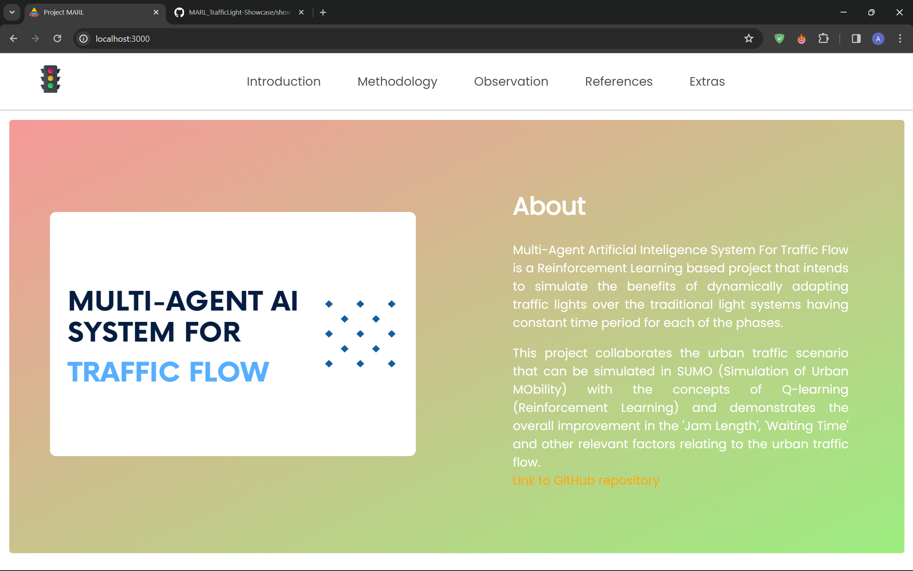
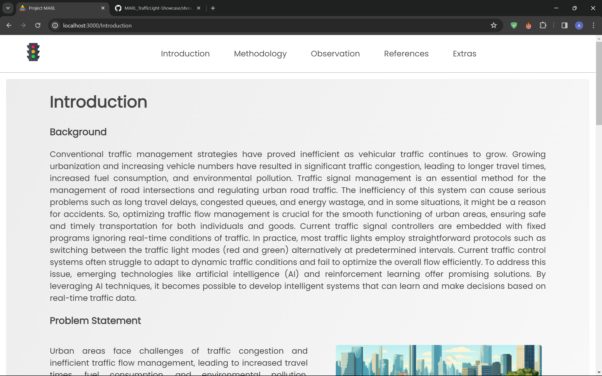
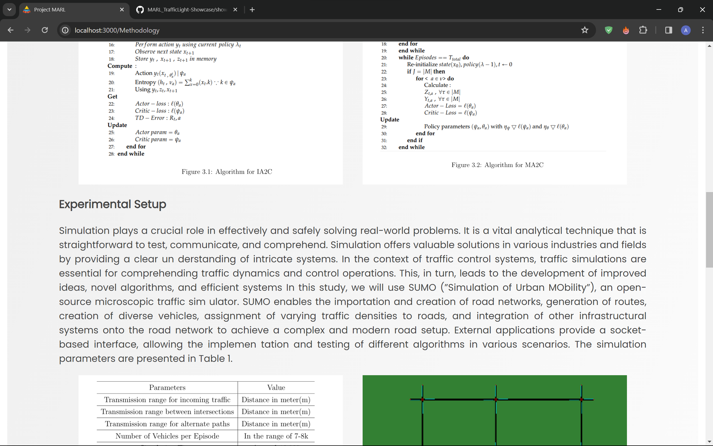
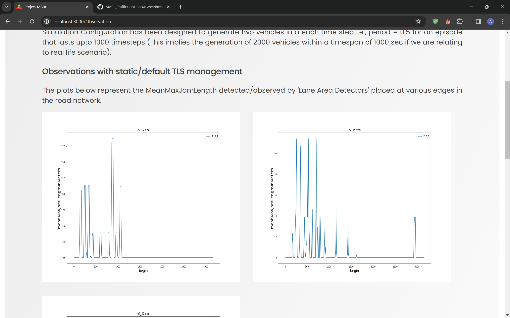
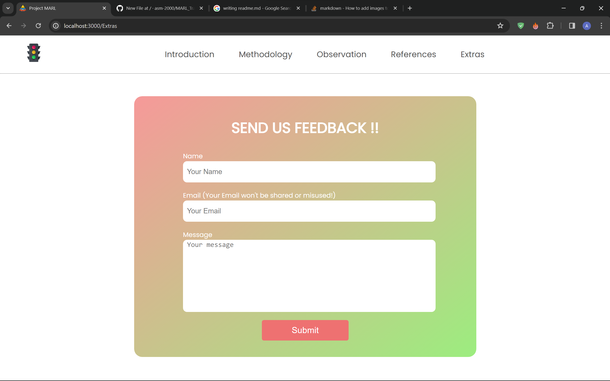

## Installing Dependencies

#### Run following commands in terminal (In MARL_TrafficLight-Showcase directory)

##### cd showcase_frontend
##### npm install
##### cd ..
##### cd backend
##### npm install

## Snapshots

